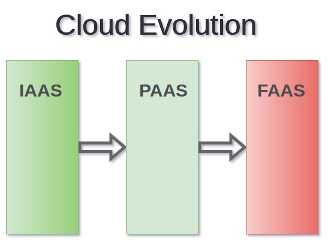

Cloud technologies and services are evolving rapidly and startups are not the only adopters anymore. I can see that many German companies are moving their infrastructure to the cloud, either entirely or partly (hybrid clouds). 

In this post I want to take you for a cloud journey! Follow along if you have time.

<!--more-->

In 2006 Amazon launched AWS (Amazon Web Services) offering IAAS (Infrastructure As A Service) providing compute and storage capacity to clients. The S3 service was in my opinion a game changer at the time, only paying for storage you actually used without needing to forecast storage needs offered companies to innovate in the storage domain. Think, backup companies and personal data storage (dropbox).

Although a game changer, it wasn't until Google introduced App Engine in 2008 that the cloud computing space turned into an industry. App Engine was one of the first PAAS (Platform As a Service) solution and at that time a popular one. 

With IAAS developers didn't need to worry about the physical hardware however they still needed to manage the operating system (security patching, os updates..etc..).

With PAAS developers don't need to worry about the operating system anymore and can focus on their code. PAAS is still going strong and many companies utilize a set of private and public cloud PAAS solutions. Red Hat's OpenShift and Cloud Foundry are probably the most widespread open source multi cloud PAAS solutions.

FAAS (Function As A Service) or serverless is the next big thing in my opinion. With PAAS even though we don't have to take care of the operating system we still need to provision one and run it 24/7 and thus pay for the underlying resources. With FAAS we don't need to provision anything and don't need to pay anything if the service (function) isn't executing.

I can already see startups architecting their software to fit these new concepts and also older companies starting to migrate to serverless architectures. One predecessor to be able to adopt serverless solutions is to build decoupled applications and to have developers think in events/triggers as opposed to the classical OOP design.

### What FAAS providers are out there?

AWS Lambda is the undisputed leader considering market traction. Other notable solutions are Azure Functions, Google Functions and Bluemix OpenWhisk.

### How does FAAS work under the hood?

That's a topic for a new post but you can go and read how it is implemented in the open source project Bluemix OpenWhisk [here](https://medium.com/openwhisk/uncovering-the-magic-how-serverless-platforms-really-work-3cb127b05f71)

### If I want to migrate my app to FAAS what options do I have?

It depends on your current application and the language it is written in. As of now (Mai, 2016) Google functions only supports JavaScript. AWS lambda supports Java, JavaScript, Python and C#. Azure Functions supports JavaScript, C#, F#, as well as Python, PHP, Bash, Batch, and PowerShell.

So if your application is written in Java your options are limited to AWS Lambda, if your application is written in PHP you will need to look at Azure.

### My company wants to go serverless on a private cloud how do we do that?

In my opinion if you decide going serverless the real benefits are only seen when you adopt a public cloud. I don't see no real benefits for companies going for in house serverless solutions. You might as well run your applications in containers on kubernetes.

### How do I get started with FAAS architecture?

Their exists several serverless frameworks, the ones with the most traction (number of contributors) are:

 - [Serverless](https://serverless.com/)(Support for Java, JS and Python)
 - [Chalice](https://github.com/awslabs/chalice) (Python only support)
 - [Zappa](https://www.zappa.io/) (Python only support)
 - [Claudia](https://claudiajs.com/) (JS only support)

If you need help designing your app to have a serverless architecture, send me an email!

