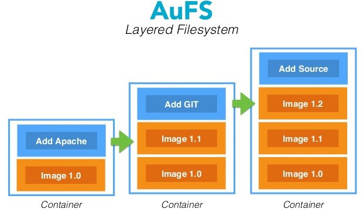

Most of the time we don't have to deal with building and shipping docker images because the community has already built quite a number of useful images for us. However, if you practice DevOps with Docker (you should) chances are you have to build custom images for your services. Maybe some developers in your organization have a service running NodeJS, maybe others are writing Java APIs, obviously for these services you have to build your own images and today I would like to describe two ways of building and shipping docker images.

Note that I haven't used the word container in the above paragraph although in many places online the word container is sometimes used interchangeably with the meaning of images. Which is not correct. A Docker container is a running instance of a Docker image. A Docker image can be considered as the "source code" for the container. Docker images are made up of union file systems layered over each other and are build step-by-step using a series of instructions. We will see this in action now by building an image in two ways.



====

### 1. Dockerfile

The most common way building Docker images is to define the series of instructions in a Dockerfile. For example, save the following in a file named Dockerfile:


```
FROM alpine:3.6

RUN apk update && apk add openjdk8


Entrypoint ["java"]
```

Now we can build this Dockerfile to an image by running:

```bash
docker build -t alpine-jdk:8 .
```

Notice the dot and the space behind the version number 8. This dot tells the docker daemon to look for a Dockerfile in the current directory. If you named the Dockerfile differently you could do:

```
docker build -t alpine-jdk:8 -f DockerFileName .
```

<br />

To test this image we can spin a one time container off it by running:


```
docker run --rm -it alpine-jdk:8 -version
```

This command will run an instance of the alpine-jdk8 image issuing the  java version command and exit. After exiting the docker daemon will remove the container. The --rm flag tells the docker daemon to remove the container after running it. You can try to run the container without the --rm flag and with the --name flag giving the container a name, like:

```
docker run -it --name jdk8 alpine-jdk:8 -version
```

Now after the version is displayed the container will exit but will not be deleted. We can view the container by running

```
docker ps -a
```

and re-run the container

```
docker start -i jdk8
```


### 2. Committing to an Image

The second way we can create a Docker image is by building it interactively from within a base container. If we use the same base image as previously (alpine:3.6) we can build an alpine-java image by running:

```
docker run -it --name alpine-jdk8 alpine:3.6 /bin/sh
```

this would drop us into the shell of alpine, from here we can issue the install commands as described in our Dockerfile before:

```
> apk update
> apk add openjdk8
```

We can view the changes made to our base file system (alpine 3.6) by running the following command from another shell

```
docker diff alpine-jdk
```

C means created, A means Appended
Now that we have installed openjdk8 land verified the installation lets save a copy of this container in the form of an image:

```
docker commit -a YourName alpine-jdk DockerRepo/alpine-jdk8
```


We can verify the image was created

```
docker images
```

should list the DockerRepo/alpine-jdk8 image we just created. We can exit the running container where we installed jdk8 by pressing Ctrl+d on the keyboard.

Some of you might think why would I need to interactively make a Docker image, why not just write the steps to a Dockerfile?

Don't get me wrong you should be writing all your Docker images in Dockerfiles and keep them in version control, however sometimes when I build Docker images based off alpine-linux I receive strange errors and in order to debug these errors I find it better to be "inside the image". After I have finished debugging the errors I write the steps to a Dockerfile. So yes most if not all the time you should be writing Dockerfiles and build images of them.

Now that we have seen two ways of building Docker images lets look at two ways of shipping them.


### 1. Pushing to a Docker repository

This is the most common method of shipping images. You tag the image with the repository URL and issue a docker push command

```
docker tag IMAGE_ID DockerRepo/image-name:image-version
docker push DockerRepo/image-name:image-version
```

To find the IMAGE_ID run the **docker image** ls command.


The problem with this method is that most organizations have their private docker repositories not accessible from the internet. So If I want to deliver an updated version of a service I have written I cannot push my image directly. I could push the image to the Docker Hub and tell the client to pull the image from there but that is also not an option since most organizations don't want their code somewhere on the internet.

Now I hear some of you shouting VPN and proxies but most of the time I don't get access to that either so the only solution is to package the images. Luckily for me the Docker daemon makes this really is.


### 2. Saving Docker images to a Tar Archive

```
docker save alpine-jdk8 > alpine-jdk8.tar
```

The tar file can be further processed with gz and shipped to the customer. On the other end the customer just needs to issue a load command

```
docker load < alpine-jdk8.tar
```

We have seen two ways of building Docker images one is to write Dockerfiles and the other is issuing the steps directly in a base container running bash / sh and committing the changes made to the container file system with the docker commit command. We then saw two ways of shipping the images. The most common one is to push the image to private or public docker repository and the other method is to save the image to a tar archive and ship it the old way using email / FTP / SCP ...etc..

If I forgot something please let me know :)

