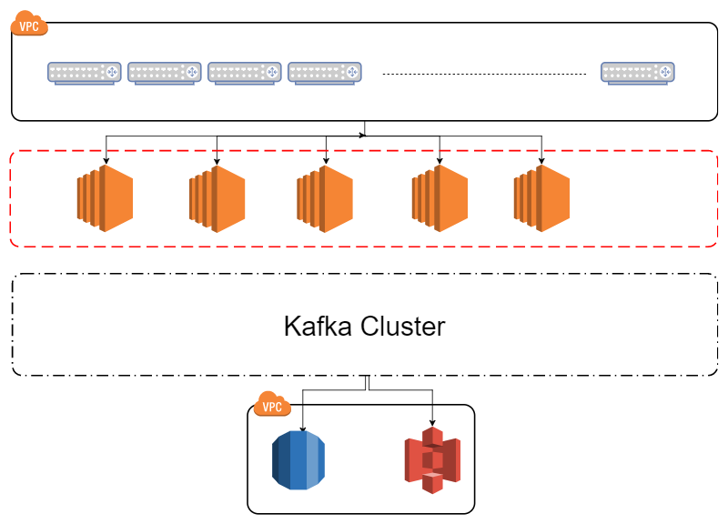

The other day I received an email from AWS with their latest announcements. I went through the email and saw that AWS now offers a new kind of ELB namely the [Network Load Balancer](http://docs.aws.amazon.com/elasticloadbalancing/latest/network/introduction.html) (NLB). Compared to the [ALB](http://docs.aws.amazon.com/elasticloadbalancing/latest/application/introduction.html) and the [ELB classic](http://docs.aws.amazon.com/elasticloadbalancing/latest/classic/introduction.html) the NLB is a layer 4 load balancer (transport). When I clicked the link, the AWS webpage states the following "*The Network Load Balancer for the Elastic Load Balancing service is designed to handle millions of requests per second while maintaining ultra-low latencies*" and I thought to myself why didn't AWS offer this ELB a year ago when I needed a network load balancer :)

A year ago I worked on a project where the requirements were to capture NetFlow traffic and query CPEs (Customer Premises Equipment) of their status through the SNMP protocol. The SNMP part wasn't that big of a challenge but the NetFlow was more of a challenge. Having 10.000 CPE each with at least 10 interfaces bombing your backend is quite a challenge. One of the requirements was data integrity since the data would be used in a commercial manner. Our initial design consisted of having 5x EC2 instances with NetFlow parsers that would parse and forward (produce) the data to an Apache Kafka cluster. The following picture shows a simplified design

====

The problem with this design is that you have to guess the number of EC2 instances needed to parse and forward the NetFlow data. The reason we couldn't use an AutoScalingGroup (ASG) was that in the router itself NetFlow is configured with an IP, for example in Cisco

*ipflow-export destination 10.0.0.134 2055*

 

This command would configure a Cisco router to send NetFlow to the EC2 instance with IP 10.0.0.134 on port 2055. The Cisco router can take IPs and hostname records as valid destinations but not DNS names.

What we did was we configured 2000 CPEs per EC2 instance. There was a lot of manual tweaking involved since some CPEs generate more flow data than others.

After reading the announcement from AWS I immediately started digging deeper into their NLB service. As it turns out it can solve all the problems we had. We can position the NLB in front of the EC2 instances and let the NLB handle the routing of the UDP NetFlow data. The NLB also enables us to stop trying to predict the number of required EC2 instances. We can now put the EC2 instances in an ASG and scale in and out with the ingested data! But the biggest win, in my opinion, is the need to manually configure the CPEs with the IPs of EC2 instances. With AWS NLB we get a static IP per availability zone! :=)

I welcome the addition of NLB and think the NLB will enable other people working with IoT or similar customer endpoint devices to abstract a layer out of their architecture and let people focus more on their core problems.

