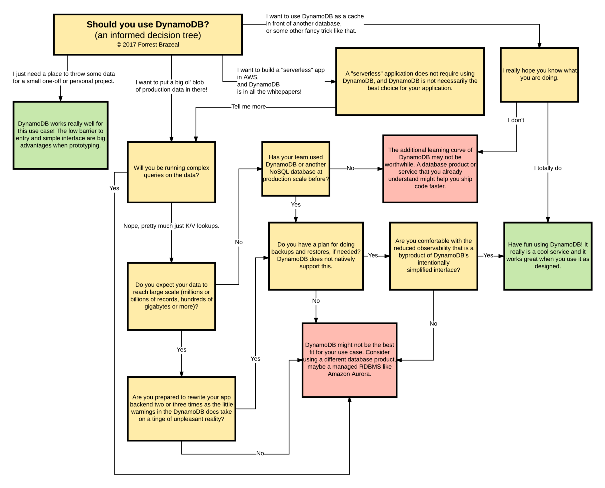

Having seen projects that use DynamoDB as their persistence layer with good results, I have also seen many projects where DynamoDB wasn't suitable but was used regardless. Upon asking the question why DynamoDB was chosen the answers were usually unclear and defensive. All good Architects and Engineers should ask themselves before using a new technology what the benefits are, the technology will bring and if these benefits warrant the inclusion of the technology.

In this post, I will list a couple of answers to the simple question "Why did you go with DynamoDB" with my remarks based on my experience with DynamoDB. Let's start with the most common answer:

> We don't have to think about scaling the system it is done for us

Yes, scaling is done behind the scenes by AWS, for every 10GB of data a new Node is added but what people forget is that when you initially provision 30 RCU/WCU and suddenly your data grows and you have 2-3 Nodes the provisioned RCUs/WCUs is a total of all Nodes. Hence if a query throws a **ProvisionedThroughputExceededException** you can't provision more throughput on a Node by Node basis you will have to overprovision your throughput or re-design your data model. Also with the newly introduced auto-scaling feature for provisioned throughput, care must be taken to not exceed budget limits because of a bad initial data model design.

====

> It's so simple getting started with

I agree that it is simple to get going, you throw data in DynamoDB and that's that. I can see how it is convenient to prototype apps with DynamoDB instead of messing around with schemas and relations in an RDBMS but please don't confuse the simplicity of interfacing with DynamoDB with the complexity needed to design a DynamoDB architecture. In the beginning, you will probably only use simple key-value lookups and a handful of scans but later in your project, you will encounter the need for doing more involved queries and as your query needs grow, the more the initial design will bite you in the ass. The reason for this is that most devs don't know how to model a dataset in DynamoDB. You might say that they can learn it and that's possibly true but once you designed your data model it is really tricky to change. You can't add local secondary indexes any more hack you can't even change the originally defined sort key. At this point you might be saying that DynamoDB supports global secondary indexes (GSIs) and that's true but GSIs are essentially just another table that contains projections of the data that lets you choose different hash/range keys than originally planned. If you are willing to pay double for your data go with GSIs but also remember that the data in the GSIs are not guaranteed to be the latest because DynamoDB uses eventual consistency for projecting the data to the indexes.

> Query times are consistent regardless of data amounts

Yes, AWS even states this on their [webpage](https://aws.amazon.com/dynamodb/) "single-digit millisecond latency at any scale" but the problem is again the design of the data model. You really need to choose a good partition key (primary key) or composition key (partition key and sort key), if you go for the latter, remember you need to include both the partition key and sort key when querying (Although you could use **begins_with** filter on the **sort key** and thus wouldn't need to specify a full value). And don't forget to use the local secondary indexes you get 5 per table and you can only define them in the beginning.

### Takeaway

My takeaway for DynamoDB is to use it in applications with high write load where data access patterns (queries) are known beforehand and don't change over time. Note that I didn't say high read load because I am still debating if the "hot key" [problem](https://segment.com/blog/the-million-dollar-eng-problem/) is preventable in the design of the data model or if it's only preventable with the use of a caching layer in front of DynamoDB. It seems a hard problem and AWS recently introduced [DAX](https://aws.amazon.com/dynamodb/dax/) an in-memory cache for DynamoDB, probably to help with this problem. Unfortunately, it isn't available in eu-central-1 (Frankfurt) and only the JAVA and JS SDKs, as of right now, are supported.

As for a final thought checkout this funny but accurate decision tree made by Forrest Brazeal

